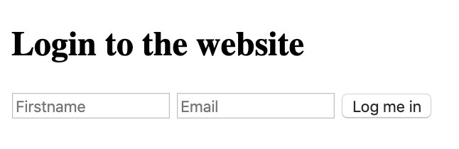

# Cookies_local_storage
Project where we learn how to create cookies and manipulate the browser's local storage.

Topics Covered:
- Understand how to create cookies using Javascript
- Learn how to set specific settings for the cookie
- Learn how to read cookies with Javascript
- How to use js-cookie for easy cookie manipulation
- How to use the browser web storage
- The differences between local storage and session storage

Tasks:
- [0. Create basic cookie](#0-create-basic-cookie)
- [1. Create cookie with expiration date and specific path](#1-create-cookie-with-expiration-date-and-specific-path)
- [2. Read cookie](#2-read-cookie)
- [3. Delete cookie and mini application](#3-delete-cookie-and-mini-application)

## 0. Create basic cookie
**Install your development environment:**

- Install`webpack-dev-server` by running `npm install webpack-dev-server --save-dev` (if you have some errors of missing dependencies, install these packages: `npm i -D webpack` and `npm i -D webpack-cli`)
- Create an empty file `src/index.js`
- Run your server with `node_modules/.bin/webpack-dev-server`

**In a file `0-index.html`, create a basic html template:**

- Add two text inputs, with the id `firstname` and `email`
- Add one button with the text “Log me in” that will call the function `setCookies`
- Add one button with the text “Show the cookies” that will call the function `showCookies`
- Create a function `setCookies`:
    - It should set the cookie `firstname` with the value in the `firstname` input
    - It should set the cookie `email` with the value in the `email` input
- Create a function `showCookies`:
    - It should create a DOM element `p`
    - It should set the inner html with `Cookies:` and the value of the cookie
    - It should append the paragraph at the bottom of the page

**Requirements:**

- Try to make your page to look as close to the image below as possible

- Access your code with `http://localhost:8080/0-index.html`
- Use vanilla javascript to complete the task

- File: `package.json, src/index.js, 0-index.html`

## 1. Create cookie with expiration date and specific path
**In a file `1-index.html`:**
- Reuse the code of the previous task
- Modify the way you are setting cookies to expire in 10 days

**Requirements:**
- Access your code with `http://localhost:8080/1-index.html`
- Use vanilla javascript to complete the task
- File: `1-index.html`

## 2. Read cookie
**In a file `2-index.html`:**
- Reuse the code of the previous task.
- Create a function `getCookie`:
    - It accepts `name` as argument
    - It should return the value of the cookie with the `name` passed in argument
    - If the cookie does not exist, it should return an empty string
- Modify the function `showCookies`:
    - It should display the paragraph `Email: EMAIL - Firstname: FIRSTNAME`

**Requirements:**
- Access your code with `http://localhost:8080/2-index.html`
- Use vanilla javascript to complete the task
- File: `2-index.html`

## 3. Delete cookie and mini application
**in a file `3-index.html`, reuse your code from the previous task**
- add a `div` in html that will contain the login form:
    - You can reuse the one you previously wrote
    - It has one `h2`
    - It has two text inputs
    - It has one button
- Write a function named `showForm`:
    - It should remove the Welcome message if it exists
    - It should show the form
- Write a function named `hideForm`:
    - It should hide the form
- Write a function named `deleteCookiesAndShowForm`:
    - It should remove the two cookies
    - it should show the form by calling the `showForm` function
- Write a function named `showWelcomeMessageOrForm`:
    - if user is not logged in, the function `showForm` is called
    - If the user is logged in, replace the body of the page with a `h1`
        - It should display `Welcome FIRSTNAME (logout)`
        - `(logout)` should be a link
            - The link font should be display in normal weight, italic, and 10px to the right of the message
            - On click, call the function `deleteCookiesAndShowForm`, hide the welcome message, and show the form

**Requirements:**
- Access your code with `http://localhost:8080/3-index.html`
- Use vanilla javascript to complete the task
- Build the Welcome message with Javascript without using HTML
- File: `3-index.html`

**The login form should look like the image below**

**When a user is logged in the page should look like the image below**

