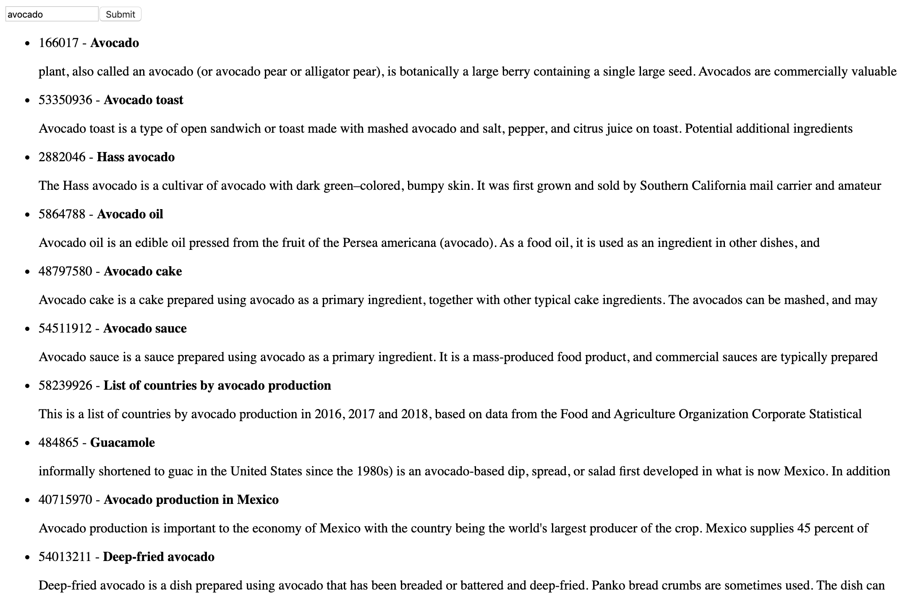

# JQuery_advanced
Project where we learn how to load and use JQuery.

Topics covered:
- How to load jQuery from a CDN in a page
- The different ways to create DOM elements with jQuery
- How to modify elements
- How to add new elements to a page with different positions
- How to add a click handler on an element
- How to send GET, POST, DELETE or any type of AJAX query with jQuery
- How to create a pagination

Tasks:
- [0. Setup your dev environment](#0-setup-your-dev-environment)
- [1. Creating a DOM element](#1-creating-a-dom-element)
- [2. Creating multiple DOM elements at once](#2-creating-multiple-dom-elements-at-once)
- [3. Chain DOM elements](#3-chain-dom-elements)
- [4. HTML function](#4-html-function)
- [5. Click attribute and remove function](#5-click-attribute-and-remove-function)
- [6. Val, before, and prepend functions](#6-val-before-and-prepend-functions)
- [7. Ajax](#7-ajax)
- [8. Pagination](#8-pagination)

## 0. Setup your dev environment
**Modify the starter file:**
- Load the latest version of jQuery using their `code.jquery.com` CDN
- Use the Slim & minified version of jQuery
- When the page is being loaded, verify that jQuery is loaded correctly
- If jQuery is ready to be used, log to the console `jQuery has been loaded correctly`
- If jQuery has not been loaded properly, log to the console `jQuery has not been loaded correctly`

**Requirements**
- Make sure your code is in a `script` of type `application/javascript`

---

<details>
<summary>Starter file</summary>

```html
<!DOCTYPE html>
<html lang="en" dir="ltr">

    <head>

        <meta charset="utf-8" />
        <title>Task 0</title>

    </head>

    <body>

    </body>

</html>
```
</details>

---

File: `0-index.html`

## 1. Creating a DOM element

**Reuse the template you created previously.**
- Remove the code that verifies jQuery loaded and logs messages to the console
- Create a function named `createTextElement`:
    - Within the function, create a `p` HTML element
    - The paragraph should display `Lorem ipsum dolor sit amet, consectetur adipiscing elit. Sed in diam risus. Nunc sit amet euismod ipsum. Aenean tempus ex sed est volutpat, sed sodales velit tempus. Class aptent taciti sociosqu ad litora torquent per conubia nostra, per inceptos himenaeos. Proin auctor sollicitudin eleifend. Vivamus porta enim vitae mauris commodo, vitae tempor tellus elementum. Quisque sed pellentesque nulla, at eleifend nisi. Phasellus eget tincidunt ex. Lorem ipsum dolor sit amet, consectetur adipiscing elit.`
    - Add the paragraph to the `body` of the page
- Call the `createTextElement` function

**Requirements:**
- You must use jQuery only to generate the HTML tag and attach it to the page
- Use the keyword `append` to attach the element to the page

---

- File: `1-index.html`

## 2. Creating multiple DOM elements at once
**Reuse the template you created previously.**
- Remove the function `createTextElement`
- Create a function named `createFamilyTree`:
    - It should create a table element
        - The head of the table should display `Firstname` and `Lastname` in two cells
        - The body of the table should three rows
        - The first row should contain two cells with `Guillaume` and `Salva`
        - The second row should contain two cells with `Paulette` and `Salva`
        - The third row should contain two cells with `Antoine` and `Salva`
    - Use the keyword `append` only once to attach all the elements of the table to the page
- Call the `createFamilyTree` function

**Requirements:**
- You must use jQuery only to generate the HTML tag and attach it to the page
- The entire table code should be contained in one string

**The table created by your script should look like this**


---

- File: `2-index.html`

## 3. Chain DOM elements

**Reuse the template you created previously. Reuse also the function named `createFamilyTree`:**
- The table is containing the exact same values as the previous task
- This time, create each element one by one
- Use the keywords `append` for each element and `text` for the cells
- Do not create any intermediate variable
- Call the `createFamilyTree` function

**Tips:**
- You can append multiple elements at once, by separating the elements with a comma

**Requirements:**
- You must use jQuery only to generate the HTML tag and attach it to the page

**The table created by your script should look like this**


---

- File: `3-index.html`

## 4. HTML function

**Reuse the template you created in the previous task. Reuse also the function named `createFamilyTree`.**
- Create a new function `replaceFamilyTree`:
    - It should replace the childrens of the `tbody` elements with a new `tr`
    - The `tr` element should contain two cells with `Gerard` and `Bonissa` in each
- Make sure `createFamilyTree` and `replaceFamilyTree` are called

**Requirements:**
- You must use the keyword `html` to replace the content of the table

**The table created by your script should look like this**


---

- File: `4-index.html`

## 5. Click attribute and remove function

**Reuse the template you created previously.**
- Remove the `createFamilyTree` and `replaceFamilyTree` functions
- Create a function `createFamilyTree`:
    - It should append to the `body` an empty table, with `thead` and two cells with text `Firstname` and `Lastname`, respectively
    - It should append an empty `tbody` element to the `table` after the `thead`
- Create a function `addNewMember`:
    - It accepts two arguments `firstName`(string) and `lastName`(string)
    - It appends to the body of the `table` a new row with three cells
    - The first cell displays the `firstName`, the second cell displays the `lastName`
    - The third cell displays `(x)`
    - On click on the third cell, it should remove the row
    - Add CSS to the third cell to have an `orange` background
- Calls the function `createFamilyTree`
- Using `addNewMember`, generate a fake table with:
    - the first row `Guillaume`, `Salva`
    - the second row `Arielle`, `Snizt`
    - the third row `Fanette`, `Snizt`
    - the fourth row `Gerard`, `Snizt`
    - the fifth row `Victor`, `Salva`

**Requirements:**
- You must use the keywords `click`, `css`, and `remove`

**The table created by your script should look like this:**


---

- File: `5-index.html`

## 6. Val, before, and prepend functions

**Reuse the template you created previously.**
- Reuse the function `createFamilyTree` you wrote in the previous task
- Reuse the function `addNewMember` you wrote in the previous task, and add the following modification:
    - The function should accept a new argument `position`(string)
    - When position is equal to `before`, it should add the row at the top of the table
    - Otherwise, it should add the row at the bottom of the table
- Write a function `createForm`:
    - It should add before the table two `input` of type `text`
    - It should add a `select` with two options as well: `before` and `after` with corresponding `Before` and `After` text
    - It should add a `input` of type `submit` as well
        - When the user clicks on the submit, it should call the function `addNewMember` with the value of the two inputs and the value of the select element
- Call the function `createFamilyTree`
- Call the function `createForm`

**Requirements:**
- You must use the keywords `first`, `before`, and `prepend`
- To select the second input, use the `nth-of-type` selector

**The form created by your script should look like this:**


---

- File: `6-index.html`

## 7. Ajax

**Reuse the template you created in the previous task**
- Remove the functions from the `script`
- Import jQuery using the CDN and make sure you can access the ajax methods
    
- Create a form:
    - Create a function `createSearchForm`, it should append to the body:
        - An empty `input` of type `text` without ID, name, or class
        - An `input` of type `submit`
            - When the user clicks on the submit button, it should query the function `queryWikipedia` that you are going to create with the value of the text `input`
        - An empty `ul` element
- Create a function `addNewArticle` to add new items to a list
    - It accepts three arguments `id`(string), `title`(string), and `snippet`(string)
    - It create an element `li`
        - Within the `li`, add two `paragraph` elements
            - The first paragraph contains a `span` tag with the following text: `id -`, then a `b` element with the `title`
            - The second paragraph, should contain the `snippet`
    - Appends the `li` to the `ul` element (created by `createSearchForm`)
- Implement a get function: create a function `queryWikipedia`
    - It accepts one argument `search`(string)
    - Create a data object with attributes required to query a search using the string passed in the argument with Wikipedia
    - For each result returned by the API, call the function `addNewArticle` with the result’s `pageid`, `title`, and `snippet`
- Call the function `createSearchForm` when the page loads
    

**Requirements:**
- Look at the documentation from Wikipedia to query the API `https://www.mediawiki.org/wiki/API:Search`
- Use the minified only version of jQuery, so you can access the ajax methods
- When adding the `snippet`, make sure that the HTML coming from Wikipedia is correctly displayed

**The form created by your script should look like this:**


**Query results should display like this:**


---

- File: `7-index.html`

## 8. Pagination

**Reuse the code from the previous task**

- Modify the function `createSearchForm`:
    - It should append to the body another list, with the id `pagination`
- Modify the function `queryWikipedia`:
    - Add a new parameter named `offset`(number)
    - By default, the offset should be set to `0`
    - Modify the data object to add the `offset`
    - When you receive the response from the API, call the function `buildPagination` that you are going to create below
- Create a new function named `buildPagination`:
    - It accepts three arguments `numberOfItems`(number), `itemsPerPage`(number), and `currentOffset`(number)
    - When the function is called, reset the pagination list to an empty tag
    - Write a loop that will display the pagination (using the total number of items divided by the number of items per page)
    - For each page, create a list item
        - Add some CSS for each item (`cursor: 'pointer'`, `10px` margin left, and bold when this is the current page)
        - The text of the item should be the page number
        - When clicking on a page number, it should call the function `queryWikipedia` with the right offset

**Requirements:**
- Use the `totalhits` value from Wikipedia to define the total number of items
- Display 10 items per page
- Make sure your pages are displayed in an horizontal line

**The query results should display like this, notice how the `12` is in bold, because that is the current page**


---

- File: `8-index.html`